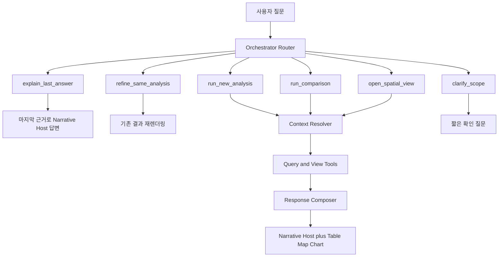

# 대전 상권 AI 챗 디자인 의견서

작성일: 2026-05-22

## 판단

현재 제품은 자연어 질문, 행정동 지도, 근거 블록, 후속 질문을 이미 한 화면에 묶고 있다. 다음 단계의 목표는 기능을 더 많이 보이는 데 두기보다 사용자가 `지역을 발견하고`, `상권을 비교하고`, `점포와 시간의 맥락을 읽는` 경험을 만드는 데 두는 것이 좋다.

이 서비스는 범용 챗봇처럼 보여서는 약하다. 반대로 지나치게 정적인 대시보드가 되어도 질문의 재미가 사라진다. 추천하는 제품 정체성은 `대화형 상권 탐색기`다. 대화는 질문의 문을 열고, 지도와 그래프는 답변의 근거를 만질 수 있게 해야 한다.

## 경험 원칙

1. 질문이 먼저다.
   첫 화면은 지도보다 질문의 여지를 먼저 보여준다. 사용자가 지역을 말하기 전까지 지도는 축소하거나 배경 수준으로 둔다.
2. 답변은 결론, 이유, 탐색 순서로 읽힌다.
   첫 문장은 수치의 핵심 결론, 두 번째 층은 비교와 변화의 이유, 세 번째 층은 지도와 그래프 탐색으로 이어진다.
3. 공간은 행정구역이 아니라 상권 감각으로 읽힌다.
   특정 동을 물으면 동 경계를 강조하고 구 경계는 문맥으로 남긴다. 업종까지 물으면 점포 점, 밀집도, 이동 맥락으로 넘어간다.
4. 재미는 장식이 아니라 반응에서 나온다.
   질문이 바뀔 때 지도 초점, 비교 기준, 그래프 형태, 후속 질문이 함께 바뀌면 사용자는 살아 있는 분석 도구로 느낀다.
5. 합성 데이터는 합성 데이터로 보인다.
   점포별 매출과 기초단위구 유동인구를 통계적으로 배분해 쓰는 경우 실제 관측치처럼 말하지 않는다.

## 추천 화면 흐름

### 1. 질문 전

- 메인 영역은 큰 질문 입력과 3-4개의 시작 질문으로 구성한다.
- 질문 칩은 기능명이 아니라 관찰 욕구를 자극한다.
  - `중앙동은 요즘 어떤 업종이 강해?`
  - `노은동 카페는 언제 붐벼?`
  - `둔산1동 편의점은 어디에 몰려 있어?`
- 지도는 숨김, 미니맵, 또는 비활성 미리보기 중 하나로 둔다. 현재처럼 첫 화면의 절반을 선점하면 질문의 중심성이 약해진다.

### 2. 지역 인식 후

- 답변과 함께 지도 패널이 열린다.
- 지도 중심은 질문된 행정동이고 해당 동 경계는 선명하게 표시한다.
- 같은 시군구 경계는 얇고 옅게 남겨 위치 문맥을 준다.
- 첫 확대 수준은 행정동이 화면의 주인공이 되도록 맞춘다. 사용자가 확대하거나 이동하면 시군구까지 자연스럽게 볼 수 있게 제한하지 않는다.
- 지역만 묻고 업종이 없으면 동 단위 상권 프로필을 보여준다.
  - 대표 업종
  - 매출 상위 업종
  - 방문 피크
  - 최근 변화

### 3. 지역과 업종 인식 후

- 답변 헤더는 `지역`, `업종`, `시점`, `관측 단위`를 즉시 드러낸다.
- 소분류 업종을 묻더라도 비교표는 기본적으로 해당 업종의 `중분류` 안에서 만든다. `카페`를 묻는 질문이면 전 업종 247개를 한꺼번에 비교하지 않고 카페가 속한 중분류의 점포 수, 매출, 변화율을 먼저 비교한다.
- 지도는 업종에 맞게 레이어를 바꾼다.
  - 점포 좌표가 있으면 점포 마커
  - 점포가 많으면 클러스터 또는 밀도 레이어
  - 점포를 누르면 점포명, 업종, 주소, 데이터 기준을 보여준다
- 집계 매출만 있는 시기에는 점포별 합성 매출을 별도 배지와 툴팁으로 표시한다.

## 답변 디자인

### 답변 구조

권장 답변은 다음 다섯 층으로 고정한다.

1. 한 문장 결론
   - 예: `2026년 2월 둔산1동 카페 매출은 서구 평균보다 높지만 최근 두 달은 둔화했습니다.`
2. 핵심 근거 3개
   - 현재 수준
   - 최근 변화
   - 비교 기준
3. 공간 근거
   - 지도 포커스
   - 점포 분포
   - 유동인구 단위 분포
4. 차트 근거
   - 질문 유형에 맞는 그래프 1개를 먼저 펼친다
   - 보조 그래프는 접는다
5. 다음 질문
   - 단순 관련 질문이 아니라 판단을 이어 가는 질문을 준다

### 질문 범위별 분석 단위

질문 범위가 넓은데 답변이 곧바로 특정 업종으로 좁아지면 사용자는 행정동의 전체 상권을 읽지 못한다. 반대로 소분류 업종 질문에 전 업종 표를 먼저 보여주면 비교 축이 너무 커진다. 아래 규칙을 기본으로 둔다.

| 질문 의도 | 기본 분석 단위 | 첫 답변 표 | 지도 레이어 |
| --- | --- | --- | --- |
| `중앙동 어때?`, `노은동 현황` | 행정동 전체 | 전체 업소 수, 전체 또는 가용 유동인구, 매출 상위 업종, 업종 구성 | 행정동 경계, 전체 점포 분포 또는 업종 밀도 |
| `중앙동 유동인구` | 행정동 전체 | 유동인구 현재값, 요일, 시간대, 최근 변화 | 행정동 경계, 기초단위구 유동인구 |
| `중앙동 카페 어때?` | 행정동 안의 소분류 업종 | 카페 현재값과 같은 중분류 비교표 | 카페 점포 마커 |
| `중앙동 카페랑 빵집 비교` | 명시된 소분류 묶음 | 지정 업종 비교표 | 선택 업종별 점포 마커 |
| `중앙동 음식점업`처럼 중분류 또는 대분류 질문 | 사용자가 말한 분류 단계 | 해당 분류 안의 소분류 구성표 | 분류 범위 점포 분포 |

행정동 현황 질문의 기본 답변 블록은 다음 순서가 좋다.

1. `행정동 프로필`
   - 기준월, 행정동, 시군구, 직접값과 합성값 상태
2. `전체 현황`
   - 업소 수
   - 유동인구
   - 집계 가능한 매출 수준
   - 점포 밀도 또는 점포 수 변화
3. `업종 구성`
   - 대분류 구성
   - 매출 상위 중분류 또는 소분류
   - 최근 증가와 감소가 큰 업종
4. `공간 보기`
   - 동 경계
   - 전체 점포 점 또는 밀도
   - 유동인구 기초단위구 레이어

소분류 업종 질문의 기본 답변 블록은 다음 순서가 좋다.

1. `업종 결론`
   - 해당 행정동에서 질문 업종의 현재 수준과 최근 변화
2. `중분류 비교표`
   - 같은 중분류 안의 소분류 업종끼리 점포 수, 평균 매출, 변화율 비교
   - 질문된 업종 행을 강조
3. `점포 보기`
   - 질문 업종 점포 마커
   - 점포명, 주소, 합성 매출 여부
4. `상위 문맥`
   - 필요할 때만 대분류나 행정동 전체 대비 비중을 보조 지표로 제시

### 말투

- 목표는 `공공기관 보고서`가 아니라 `질문에 답해 주는 친숙한 상권 답변서`다. 친근하되 가볍지 않고, 전문적이되 문장이 굳지 않게 둔다.
- `좋다`, `나쁘다`, `추천한다`보다 `높다`, `줄었다`, `집중된다`, `비교하면 이렇다`를 기본 동사로 둔다.
- 결론을 흐리지 말되 과도한 창업 권유 문장은 피한다.
- 사용자의 표현을 자연스럽게 받아 답한다. `어때?`에는 브리핑처럼 말하지 말고 먼저 한 줄 판단을 주고, `왜?`에는 지표 사이의 관계를 풀어 준다.
- 직접 관측치와 합성 세분화 값은 문장 안에서 구분한다.
  - 직접값: `행정동 집계 매출은 ...`
  - 합성값: `행정동 평균을 보존해 점포별로 배분한 탐색용 매출 분포에서는 ...`

### 답변의 체온과 인사이트

상권 챗이 숫자 카드의 음성 안내처럼 말하면 질문을 이어 갈 이유가 약해진다. 그렇다고 말을 늘이면 더 둔해진다. 답변은 짧아도 판단과 해석이 있어야 한다.

첫 답변은 보통 3-5문장으로 둔다. 넓은 행정동 현황 질문만 한 문단과 짧은 근거 목록까지 허용한다. 숫자는 표와 그래프가 맡고, 본문은 `무엇이 보이는지`와 `왜 그렇게 읽는지`만 말한다.

| 문장 | 역할 | 예시 |
| --- | --- | --- |
| 1문장 | 바로 답한다 | `중앙동 카페는 매출은 높은 편이지만 최근 한 달은 주춤했습니다.` |
| 2문장 | 핵심 근거를 붙인다 | `2026년 2월 월평균 매출은 1,230만원이고 전월 대비 3.2% 줄었습니다.` |
| 3문장 | 해석을 짧게 말한다 | `업소 수가 비슷한데 매출만 빠졌다면 수요 흐름을 먼저 볼 만합니다.` |
| 선택 | 데이터 주의나 다음 화면을 붙인다 | `점포별 매출 분포는 합성 배분값으로 표시합니다.` |

인사이트 문장은 숫자 하나를 반복하지 말고 관계 하나를 읽는다. 매출과 업소 수가 같이 늘었는지, 유동인구와 매출이 엇갈리는지, 질문 업종이 같은 중분류 안에서 튀는지만 짚어도 충분하다.

답변을 느리게 만드는 문장은 줄인다.

- `조회 결과입니다.`로 시작하지 않고 질문에 직접 답한다.
- 중요한 숫자는 1-3개만 문장에 넣는다.
- `살펴볼 필요가 있습니다`, `확인해 보겠습니다`, `읽는 편이 좋습니다` 같은 완충 문구는 줄인다.
- 이미 제공된 데이터로 답할 수 있으면 분석 방법을 설명하지 않는다.
- 데이터가 부족하면 부족한 범위만 한 문장으로 말한다.

### 질문별 짧은 골격

| 질문 | 본문 골격 |
| --- | --- |
| `중앙동 어때?` | `중앙동은 {핵심 특징}이 먼저 보입니다.` `업소 수 {값}, 유동인구 {값}, 매출 상위 업종은 {업종}입니다.` `{변화 또는 비교 인사이트}.` |
| `중앙동 카페 어때?` | `중앙동 카페는 {수준 판단}이고 {변화 판단}입니다.` `{매출 또는 업소 수 근거}.` `{같은 중분류 비교 또는 매출-업소 수 해석}.` |
| `중앙동 편의점 어디 있어?` | `중앙동 편의점은 {점포 수}곳입니다.` `지도에 점포 위치와 점포명을 표시합니다.` `{밀집 구간이 있으면 한 문장}.` |
| `노은동 카페랑 둔산1동 카페 비교` | `{우세 지역}이 {지표}에서 앞섭니다.` `{두 지역 핵심 수치}.` `{차이를 만든 변화 또는 유동인구 해석}.` |

### 후속 질문

후속 질문은 네 갈래를 유지하면 좋다.

- `시간`: 언제 강한가
- `공간`: 어디에 몰렸나
- `비교`: 주변 동이나 구 평균과 무엇이 다른가
- `점포`: 실제 점포 목록과 위치는 어떤가

### 대화가 이어지는 방식

이 제품은 질문마다 처음부터 조건을 다시 입력하게 하면 챗봇이 아니라 검색 폼에 가깝다. 한 번 `중앙동 카페`를 물었으면 다음 질문의 기본 문맥은 중앙동, 카페, 기준월, 방금 본 지표다.

| 사용자 후속 질문 | 내부 해석 | 화면 반응 |
| --- | --- | --- |
| `그럼 유동인구는?` | 방금 본 지역의 유동인구 | 답변과 유동인구 그래프 전환 |
| `편의점은?` | 방금 본 지역의 편의점 | 업종을 편의점으로 바꾸고 점포 지도 전환 |
| `지난달이랑 비교해줘` | 같은 지역, 같은 업종의 시점 비교 | 월별 시계열과 변화표 |
| `다른 동과 비교해줘` | 같은 업종의 행정동 비교 요청 | 비교할 동 제안 또는 선택 |
| `노은동이랑 비교해줘` | 방금 본 지역 대 노은동, 같은 업종 | 2지역 비교 모드 |

후속 질문은 아래 원칙으로 복원한다.

1. 새 질문에 지역이나 업종이 있으면 새 값이 우선이다.
2. 빠진 지역, 업종, 기준월, 지표는 직전 분석 맥락에서 채운다.
3. 비교 대상이 하나 비면 최근 본 지역이나 유사 상권 후보를 제안한다.
4. 후보가 둘 이상이면 억지로 추정하지 않고 한 번만 고르게 한다.
5. 대화 맥락은 Gemini 문장 기억만 믿지 말고 앱 상태로 저장한다.

권장 대화 상태는 아래 정도면 충분하다.

| 상태 | 예 |
| --- | --- |
| `activeDistrict` | `중앙동` |
| `activeIndustry` | `카페` |
| `activeMetric` | `sales` |
| `activeMonth` | `202602` |
| `comparisonDistricts` | `중앙동`, `노은1동` |
| `lastView` | `industryOverview`, `mapStores`, `compareDistricts` |

이 상태가 있어야 `거기는?`, `그 동이랑 비교`, `유동인구만` 같은 짧은 말도 데이터 조회 조건으로 바뀐다.

## 그래프와 지도

### 그래프 선택 규칙

| 질문 | 첫 그래프 | 보조 그래프 |
| --- | --- | --- |
| `행정동 어때?` | 전체 현황 대시보드와 업종 구성 | 상위 업종 시계열, 유동인구 시간 패턴 |
| `업종 어때?` | 중분류 비교표와 비교 막대 | 질문 업종 월별 시계열 |
| `매출` | 월별 매출 시계열 | 동, 구, 시 평균 비교 |
| `추세` | 월별 선 그래프 | 이동평균, 전년동월, 변곡 구간 |
| `유동인구` | 시간대 x 요일 히트맵 | 월별 유동인구 시계열, 기초단위구 지도 |
| `비슷한 상권` | 기준 상권 대 후보 비교표 | 지표별 차이 막대와 시계열 겹침 |

### 분석 그래프 체계

현재 제품의 그래프는 `현재값 한 장`, `단순 월별 목록` 수준에 머물면 답변을 증명하지 못한다. 그래프는 표출물이 아니라 질문을 해석하는 순서여야 한다. 최소 그래프 체계는 네 층으로 둔다.

| 층 | 목적 | 권장 그래프 |
| --- | --- | --- |
| 수준 | 지금 얼마인가 | KPI, 현재값 대 기준값 막대, 분위 위치 |
| 시간 | 어떻게 변했나 | 월별 시계열, 이동평균, 전년동월 겹침 |
| 비교 | 무엇과 다른가 | 행정동 대 구 대 시, 중분류 내 업종 비교, 유사 상권 비교 |
| 구조 | 왜 그렇게 보이나 | 업종 구성, 시간대/요일 히트맵, 점포 분포와 유동인구 지도 |

### 반드시 추가할 그래프

1. `월별 시계열`
   - 매출, 업소 수, 유동인구를 최소 12-14개월 보여준다.
   - 질문 업종과 비교 기준을 겹쳐 본다.
   - 매출과 업소 수는 필요하면 이중축보다 탭 전환이나 small multiples를 우선한다.
2. `기준선 비교`
   - 선택 행정동
   - 같은 시군구 평균
   - 대전 평균
   - 비교 질문에서는 선택한 다른 동
3. `중분류 비교`
   - 소분류 업종 질문에서 기본으로 제공한다.
   - 질문 업종 행을 강조하고, 같은 중분류의 점포 수, 평균 매출, 증감률을 같이 본다.
4. `점포 분포`
   - 합성 매출 점포 데이터가 있으면 점포별 합성 매출 분포를 box plot, strip plot, 구간 histogram 중 하나로 보여준다.
   - 평균만 보여주는 답변에서 점포 편차를 읽게 해 준다.
5. `유동인구 시간 패턴`
   - 시간대 x 요일 heatmap
   - 질문 업종과 공간적으로 연결할 때 기초단위구 히트 지도와 함께 둔다.
6. `유사 상권 차이`
   - 레이더 차트보다 지표별 차이 막대와 시계열 겹침을 먼저 쓴다.
   - `매출 수준`, `업소 수`, `유동인구`, `변화율`이 어디서 비슷하고 다른지 보이게 한다.

### 질문별 그래프 패널

#### 행정동 현황

`중앙동 어때?`의 답변에는 아래 패널이 자연스럽다.

1. 전체 업소 수, 가용 매출, 유동인구 KPI
2. 대분류 또는 중분류 업종 구성 stacked bar
3. 매출 상위 업종과 최근 변화 업종 비교표
4. 행정동 전체 매출 또는 대표 업종 월별 시계열
5. 유동인구 요일/시간 패턴

#### 소분류 업종

`중앙동 카페 어때?`의 답변에는 아래 패널이 자연스럽다.

1. 카페 현재값과 변화율
2. 카페가 속한 중분류 비교표
3. 카페 월별 매출 시계열
4. 카페 업소 수 시계열
5. 카페 점포 합성 매출 분포
6. 카페 점포 지도와 유동인구 지도 겹쳐보기

#### 비교 질문

`둔산1동 카페랑 노은1동 카페 비교`의 답변에는 아래 패널이 자연스럽다.

1. 두 행정동 KPI 비교
2. 월별 매출 시계열 겹침
3. 업소 수와 유동인구 차이 막대
4. 중분류 내 위치 비교
5. 지도 side-by-side 또는 같은 스케일의 두 지도

### 그래프 상호작용

- 그래프 범례에서 비교 기준을 켜고 끌 수 있어야 한다.
- `매출`, `업소 수`, `유동인구`는 탭이나 segmented control로 전환한다.
- 시계열에서 월을 선택하면 지도와 점포 목록도 같은 기준월로 바뀌는 방향을 목표로 한다.
- 비교 그래프는 기준선과 단위를 고정해 사용자가 차이를 과장해서 보지 않게 한다.
- 합성 점포 매출 그래프는 제목과 범례에서 `합성 배분`을 표시한다.

### 2지역 비교 모드

`노은동이랑 비교해줘`처럼 대화가 비교로 꺾이면 기존 답변 카드에 비교표 하나만 추가하지 않는다. 화면 자체가 비교 모드로 전환되어야 한다.

| 영역 | 비교 모드 |
| --- | --- |
| 답변 | 어느 지역이 어떤 지표에서 앞서는지 3-5문장으로 말한다 |
| 지도 | 같은 줌과 같은 범례를 쓰는 2개 지도 또는 좌우 분할 지도 |
| 표 | 매출, 업소 수, 유동인구, 변화율을 같은 행에서 비교 |
| 그래프 | 같은 축의 월별 시계열 겹침과 차이 막대 |
| 점포 | 같은 업종 점포 마커를 지역별 색으로 구분 |

비교 질문의 첫 화면은 아래 순서가 좋다.

1. `비교 결론`
   - `둔산1동 카페가 매출은 앞서고, 노은1동은 유동인구 흐름을 같이 볼 만합니다.`처럼 먼저 차이를 말한다.
2. `핵심 비교표`
   - 두 지역의 같은 지표를 한 줄씩 나란히 둔다.
3. `2지도`
   - 두 행정동을 같은 스케일로 보여 준다.
4. `비교 그래프`
   - 월별 매출, 업소 수, 유동인구 중 질문에 맞는 축 하나를 먼저 연다.

비교 모드에서는 두 지도의 시각 조건을 맞춘다. 한쪽만 더 확대하거나 색 범례가 다르면 사용자가 차이를 과장해서 읽는다. 지도 클릭, 표 행 선택, 시계열 월 선택도 양쪽 화면에 같이 반영하는 방향이 좋다.

### 그래프 표현

- 그래프 제목은 분석어가 아니라 질문어에 가깝게 쓴다.
  - `월별추이`보다 `최근 14개월 매출 흐름`
- 그래프 위에는 읽을 포인트를 1줄로 둔다.
  - `2025년 8월 이후 하락 구간이 길어졌습니다.`
- 축과 단위는 감추지 않는다.
- 하나의 답변에서 강조색은 하나, 비교색은 하나, 합성값 색은 하나로 제한한다.

### 지도 표현

- 지역 질문은 폴리곤 중심, 업종 질문은 점 중심으로 전환한다.
- 동 경계 강조와 구 문맥 경계는 동시에 둘 수 있다.
- 점포 수가 많으면 모든 라벨을 펼치지 않고 클러스터, 목록, 선택 상세로 나눈다.
- 유동인구 세분화 레이어는 기초단위구 단위 히트 레이어로 두되, 원본이 합성 배분이면 범례에 이를 분명히 적는다.

## Gemini 에이전트 지침

### 기본 판단

Gemini는 상권 수치를 새로 계산하는 엔진보다 `질문을 사람이 이해하는 분석으로 번역하는 엔진`으로 쓰는 편이 낫다. 집계, 비교값, 시계열 후보, 점포 분포, 합성 여부는 앱이 먼저 계산하고 Gemini에는 짧고 구조화된 근거 묶음을 준다. 그러면 빠른 Flash 계열 모델도 말투, 관찰 포인트, 다음 질문을 만드는 데 집중할 수 있다.

프롬프트 튜닝의 목표도 문장을 무조건 길게 만드는 것이 아니다. 아래 세 가지를 반복해서 만족시키는 답변을 만드는 것이다.

1. 첫 문장에 질문의 답이 있다.
2. 숫자 뒤에 해석이 있다.
3. 다음 화면 행동이 자연스럽다.

### 병렬 3역할 제안

질의마다 같은 긴 프롬프트를 세 번 돌려 같은 답을 기다리면 느리기만 하다. 먼저 로컬 파서와 쿼리 엔진이 지역, 업종, 기준월, 계산된 근거를 확정하고, 그 다음 세 Gemini 역할이 같은 근거 묶음을 병렬로 읽게 한다.

| 역할 | 출력 | 재미와 효율 |
| --- | --- | --- |
| `Signal Analyst` | 눈에 띄는 변화, 비교 차이, 서로 충돌하는 지표, 데이터 주의점 JSON | 숫자 요약을 인사이트 후보로 바꾼다 |
| `Narrative Host` | 사용자에게 스트리밍할 본문 답변 | 화면이 기다리지 않고 챗봇이 먼저 말문을 연다 |
| `Explorer Director` | 펼칠 그래프, 지도 레이어, 후속 질문 3개 JSON | 답변과 시각 탐색이 같이 움직인다 |

이 구조에서는 `Narrative Host`가 먼저 도착하면 본문을 스트리밍하고, `Signal Analyst` 결과가 오면 핵심 발견 칩이나 근거 문장을 보강하며, `Explorer Director` 결과로 그래프와 지도 포커스를 정한다. 의도 파싱이 모호할 때만 현재처럼 별도 fallback 호출을 두고, 일반 질의의 세 병렬 역할과 섞지 않는 편이 흐름이 단순하다.

### 공통 입력 계약

세 역할에는 같은 근거 계약을 준다.

- `question`: 사용자의 원문 질문
- `scope`: 행정동, 시군구, 업종 분류 단계, 기준월
- `facts`: 앱이 계산한 현재값, 비교값, 전월/전년동월 변화, 피크 시간, 데이터 상태
- `series`: 그래프에 쓸 수 있는 월별 요약과 비교 기준
- `mapFacts`: 점포 좌표 수, 경계, 유동인구 레이어 가용 여부
- `dataPolicy`: 직접값, 대체값, 합성값을 어떻게 말해야 하는지

근거에는 사람이 읽는 문장과 기계가 읽는 값이 같이 있어야 한다. `amtYoY: -12.4`만 던지지 말고 `매출 전년동월 대비 -12.4%`처럼 단위가 붙은 라벨도 함께 준다. 반대로 Gemini가 차트용 숫자를 다시 계산하게 두지 않는다.

### 후속 질문 해석기

대화형으로 가려면 내레이터보다 앞단에 `Context Resolver`가 하나 더 필요하다. 이 역할은 답변을 쓰지 않고 새 질문이 직전 맥락을 이어받는지, 어떤 값이 생략됐는지, 비교 모드로 전환해야 하는지만 정한다.

권장 출력은 짧은 JSON이다.

| 필드 | 역할 |
| --- | --- |
| `carryDistrict` | 직전 지역을 이어받을지 |
| `carryIndustry` | 직전 업종을 이어받을지 |
| `metric` | 매출, 업소 수, 유동인구, 점포, 추세 |
| `viewMode` | 단일 지역, 점포 지도, 시점 비교, 2지역 비교 |
| `compareTargets` | 새 질문에서 명시된 비교 지역 |
| `needsClarification` | 비교 대상이나 대명사가 모호한지 |

예를 들어 `중앙동 카페` 답변 뒤 `노은동이랑 비교해줘`가 오면 지역은 `중앙동`, 업종은 `카페`를 이어받고 비교 대상만 `노은동`으로 추가한다. 이 복원 결과로 쿼리 엔진이 두 지역 레코드를 가져오고, `Narrative Host`는 계산된 비교 결과만 설명한다.

### 오케스트레이션 라우터

`Context Resolver`만 두면 아직 부족하다. 같은 후속 질문이라도 어떤 것은 방금 답을 풀어 달라는 말이고, 어떤 것은 데이터를 다시 조회하라는 말이다. 이 둘을 구분하지 못하면 Gemini가 없는 근거로 설명하거나, 반대로 단순 해석 질문에도 불필요하게 쿼리와 그래프를 다시 만든다.

질문 처리의 첫 관문은 `Orchestrator Router`로 둔다. 이 라우터는 답변을 만들지 않고 아래 중 하나를 고른다.

| 라우트 | 의미 | 예 |
| --- | --- | --- |
| `explain_last_answer` | 방금 답변의 근거, 표현, 해석을 풀어 달라는 질문 | `왜 그렇게 봤어?`, `무슨 뜻이야?`, `좀 쉽게 말해줘` |
| `refine_same_analysis` | 같은 데이터 범위에서 보기 방식만 바꾸는 질문 | `그래프로 보여줘`, `표로 정리해줘`, `핵심만 말해줘` |
| `run_new_analysis` | 지표, 업종, 시점이 바뀌어 데이터를 다시 조회해야 하는 질문 | `유동인구는?`, `지난달은?`, `편의점은?` |
| `run_comparison` | 비교 대상을 붙여 새 비교 결과를 계산해야 하는 질문 | `노은동이랑 비교해줘`, `구 평균이랑 차이 봐줘` |
| `open_spatial_view` | 지도, 점포, 밀집 구간을 새로 보여 줄 질문 | `어디에 몰려 있어?`, `점포 위치 보여줘` |
| `clarify_scope` | 지역, 업종, 비교 대상이 모호해 한 번 되물어야 하는 질문 | `거기랑 비교해줘`인데 후보가 둘 이상 |

라우트별 실행 원칙은 분명해야 한다.

| 라우트 | 재사용 | 새 호출 |
| --- | --- | --- |
| `explain_last_answer` | 마지막 답변, 마지막 근거, 마지막 차트 인사이트 | 데이터 쿼리 없음 |
| `refine_same_analysis` | 마지막 쿼리 결과 | 렌더링 방식만 변경 |
| `run_new_analysis` | 직전 지역/업종/월 중 생략된 값 | 필요한 데이터 쿼리 |
| `run_comparison` | 직전 분석 맥락 | 비교 쿼리, 비교표, 비교 그래프, 2지도 |
| `open_spatial_view` | 직전 지역/업종 | 점포 좌표, 경계, 유동인구 지도 레이어 |
| `clarify_scope` | 후보 맥락 | 질문 한 번 |

이 규칙이 있어야 `왜?`라는 질문에 매출 조회를 다시 하지 않고, `다른 동과 비교해줘`라는 질문에 지난 답변을 말로만 되풀이하지 않는다.

### 오케스트레이션 흐름



앱 입장에서는 도구를 아래처럼 본다.

| 도구 | 맡을 일 |
| --- | --- |
| `resolve_context` | 생략된 지역, 업종, 기준월 복원 |
| `query_overview` | 행정동 전체 현황 |
| `query_metric` | 매출, 업소 수, 유동인구 단일 분석 |
| `query_compare_districts` | 두 지역 같은 범위 비교 |
| `query_trend` | 월별 시계열 |
| `query_store_points` | 점포 좌표와 목록 |
| `set_map_view` | 단일 동, 점포, 2지역 비교 지도 |
| `compose_visuals` | 표와 그래프 패널 선택 |
| `narrate` | 계산된 결과만 사용자 문장으로 설명 |

이때 라우터와 `resolve_context`는 구조화 출력만 내고, 최종 문장 생성과 섞지 않는다. 사용자가 보기 전에 앱이 `route`, `resolvedScope`, `toolPlan`, `missingSlots`를 검사할 수 있어야 한다.

### 라우터 출력 계약

권장 출력은 아래처럼 짧다.

```json
{
  "route": "run_comparison",
  "reuseLastResult": false,
  "carry": {
    "district": true,
    "industry": true,
    "month": true
  },
  "slots": {
    "metric": "sales",
    "compareDistricts": ["노은1동"]
  },
  "toolPlan": [
    "query_compare_districts",
    "query_trend",
    "set_map_view",
    "compose_visuals",
    "narrate"
  ],
  "missingSlots": []
}
```

`왜 그렇게 봤어?`라면 아래처럼 달라진다.

```json
{
  "route": "explain_last_answer",
  "reuseLastResult": true,
  "toolPlan": ["narrate"],
  "missingSlots": []
}
```

라우터가 틀리면 전체 경험이 틀어진다. 그래서 프롬프트 평가셋도 답변 품질 질문과 라우팅 질문을 분리해 관리한다.

### Gemini 2.5 Flash 무료 API를 위한 로컬-에이전트 분배

기본 목표 모델은 Google AI Studio에서 쓰는 `Gemini 2.5 Flash` 무료 API로 둔다. 다만 무료 티어는 요청 수가 넉넉하지 않으므로 목표는 `2.5 Flash를 필요한 곳에만 쓰고 로컬 앱이 분석의 뼈대를 지키는 구조`다. 에이전트는 말을 읽고 짧게 판단하는 곳에 쓰고, 수치 계산과 화면 상태는 로컬이 가진다.

| 계층 | 로컬 우선 | 에이전트 사용 |
| --- | --- | --- |
| 세션 상태 | 직전 지역, 업종, 월, 비교 대상, 마지막 결과 저장 | 없음 |
| 명시 조건 추출 | 행정동/시군구/업종 사전 매칭, 월 파싱 | 모호한 표현 보정 |
| 라우팅 | 명확한 키워드 규칙으로 빠른 라우트 | `왜?`, `그쪽`, `비교해줘`가 모호할 때 구조화 판정 |
| 분석 | 매출, 유동인구, 업소 수, 증감률, 시계열, 비교표 계산 | 계산 결과에서 짧은 해석 후보 선택 |
| 시각화 | 표, 그래프 스펙, 지도 모드, 범례, 줌 동기화 | 어떤 패널을 먼저 열지 제안 |
| 답변 | 데이터 경고, 출처, 합성 표시 강제 | 3-5문장 내러티브 |

`Gemini가 잘하면 답변이 매끄럽고, 호출이 늦어도 데이터는 틀리지 않는` 방향으로 분배한다. 특히 아래는 로컬 전용으로 둔다.

- 데이터 조회 조건 확정
- 두 지역 비교 수치 계산
- 차트 데이터와 지도 레이어 생성
- 합성 데이터 여부와 단위 표시
- 라우터 출력 검증과 도구 허용 목록 검사

2.5 Flash는 긴 컨텍스트를 받을 수 있어도 무료 API에서 매번 긴 데이터 덩어리를 넘기는 설계는 피한다. 모델 입력은 아래 순서로 얇게 유지한다.

1. 사용자 질문
2. 직전 대화 상태 요약
3. 로컬 파서 결과
4. 필요한 후보만 추린 지역/업종 목록
5. 계산이 끝난 핵심 근거 3-6개

### 호출 예산

질문당 모델 호출 예산을 먼저 정해야 무료 API 제한과 체감 속도를 같이 지킬 수 있다.

| 상황 | 권장 호출 |
| --- | --- |
| 명시 질문 `중앙동 카페 매출` | 로컬 파싱 + 쿼리 + 내레이터 1회 |
| 해석 재질문 `왜 그렇게 봤어?` | 라우터 규칙 또는 라우터 1회 + 내레이터 1회 |
| 짧은 후속 `유동인구는?` | 로컬 맥락 복원 가능하면 내레이터 1회 |
| 모호한 후속 `거기랑 비교해줘` | 라우터 1회 + 필요한 경우 확인 질문 |
| 비교 분석 `노은동이랑 비교` | 라우터/복원 1회 이하 + 비교 쿼리 + 내레이터 1회 |

3개 Gemini를 모든 질문에 병렬로 돌리는 기본값은 피한다. 빠른 질문은 1회 호출로 끝내고, 비교나 모호한 후속처럼 가치가 큰 질문에서만 `Router`, `Analyst`, `Narrator`를 나눠 쓴다. 무료 티어에서는 `3회 호출 답변`을 기본으로 삼으면 사용량과 응답 지연이 같이 빨리 찬다.

### 경량 오케스트레이션 권장안

1차 구현은 아래처럼 잡는 것이 현실적이다.

1. `LocalRouter`
   - 명확한 설명 질문, 그래프/지도 질문, 새 지표 질문, 비교 질문을 규칙으로 먼저 분류
2. `AgentRouter`
   - 로컬 판정 신뢰도가 낮을 때만 구조화 JSON 판정
3. `LocalToolRunner`
   - 허용된 쿼리와 화면 도구만 실행
4. `LocalAnalyst`
   - 비교 차이, 추세 변곡, 지표 엇갈림을 규칙으로 후보화
5. `Narrator`
   - 계산된 후보 중 중요한 것만 짧게 설명

이렇게 하면 2.5 Flash의 언어 이해력은 쓰되 분석 책임을 모델에 몰지 않고도 대화성은 살릴 수 있다.

### 지식배움터 연결

상권 챗의 지식은 두 종류로 나눈다.

| 지식 | 예 | 권장 저장 |
| --- | --- | --- |
| 운영 지식 | 업종 분류표, 행정동 alias, 질문 예시, 라우팅 규칙, 데이터 해석 정책 | 로컬 JSON/DB, 시스템 지침 |
| 설명 지식 | 지표 정의, 데이터 출처 설명, 합성 데이터 설명, 분석 가이드, FAQ | 검색 가능한 지식 저장소 |

운영 지식은 앱이 직접 가져야 한다. 업종 분류표나 행정동 후보를 LLM 기억에 맡기면 검색과 쿼리 조건이 흔들린다. 설명 지식은 필요할 때 찾아 붙이는 편이 맞다.

서비스 전에 `지식배움터`를 준비한다면 추천 순서는 아래다.

1. 짧은 기준 문서 작성
   - 지표 정의
   - 데이터 출처와 기준월
   - 직접값/대체값/합성값 말하는 법
   - 질문 유형별 답변 원칙
2. 검색 단위로 분할
   - FAQ 한 항목
   - 데이터 정책 한 항목
   - 분석 해석 예시 한 항목
3. 검색 후 주입
   - 사용자가 `합성 매출이 뭐야?`, `유동인구 기준이 뭐야?`처럼 설명을 물을 때 관련 조각만 답변 근거에 붙인다.
4. 고정 지침과 분리
   - 라우팅 계약과 금지 규칙은 system instruction
   - 길고 바뀌는 지식은 검색 저장소

이 방식은 모델에게 지식을 외우게 하는 것이 아니라, 답할 때 맞는 지식을 꺼내 주는 구조다. 서비스 설명이 자주 바뀌고 데이터 정의가 중요하므로 이쪽이 유지보수에 유리하다.

## 품질 설계서

### 품질 목표

이 서비스의 품질은 `답변이 그럴듯한가`만으로 보지 않는다. 사용자가 질문하고 10초 안에 실제로 쓸 수 있는 답을 받는지, 답변이 근거와 화면으로 이어지는지, 데이터 한계를 숨기지 않는지를 함께 본다.

| 목표 | 기준 |
| --- | --- |
| 응답 시간 | 일반 질의는 10초 이내에 첫 완성 답변과 핵심 분석 카드 표출 |
| 빠른 반응 | 질문 접수 후 1초 안에 해석/분석 중 상태 표출 |
| 데이터 정확성 | 수치 계산, 비교표, 그래프 데이터는 로컬 계산 결과만 사용 |
| 대화성 | 후속 질문에서 직전 지역, 업종, 지표 문맥을 이어받음 |
| 설명 품질 | 본문은 3-5문장, 판단-근거-해석 순서 |
| 신뢰성 | 직접값, 대체값, 합성값을 구분 |
| 폴백 | Gemini 지연/실패 시 로컬 요약과 분석 카드로 답변 완성 |

### 지식 전략 확정

Gemini 2.5 Flash는 이 서비스에서 별도 학습 모델로 쓰지 않는다. 품질 설계의 전제는 아래와 같다.

| 구분 | 설계 |
| --- | --- |
| 모델 학습 | 전제로 두지 않음 |
| 답변 스타일 | system instruction, few-shot 예시, 평가셋으로 조정 |
| 운영 지식 | 로컬 JSON/DB와 코드 정책 |
| 설명 지식 | 지식배움터 검색 후 근거 주입 |
| 대화 기억 | 세션 상태와 마지막 결과 저장 |
| 데이터 분석 | 로컬 쿼리와 규칙 기반 인사이트 |

지식배움터 검색은 모든 질문에 붙이지 않는다. 아래처럼 설명 지식이 필요한 질문에만 붙인다.

- `합성 매출이 뭐야?`
- `유동인구 기준이 뭐야?`
- `왜 카페를 같은 중분류랑 비교해?`
- `이 데이터 출처가 뭐야?`

반대로 `중앙동 카페 매출`, `노은동이랑 비교` 같은 분석 질의는 먼저 로컬 데이터를 조회하고, 지식 검색은 데이터 경고나 정의 설명이 필요한 경우에만 호출한다.

### 10초 응답 예산

10초는 모델 응답만의 예산이 아니라 사용자 체감 완료 시간이다. 기본 예산은 아래처럼 잡는다.

| 단계 | 목표 |
| --- | ---: |
| 입력 접수와 로컬 라우팅 | 0.3초 |
| 맥락 복원과 명시 슬롯 파싱 | 0.4초 |
| 로컬 쿼리와 비교 계산 | 1.5초 |
| 지도/그래프 스펙 준비 | 0.8초 |
| Gemini 2.5 Flash 내러티브 | 4.0초 |
| 렌더링과 여유 예산 | 3.0초 |
| 합계 | 10.0초 |

명확한 질문은 `로컬 분석 카드`를 Gemini보다 먼저 준비할 수 있어야 한다. Gemini 스트리밍이 4초 안에 시작되지 않으면 카드와 로컬 요약을 먼저 보여 주고, 내러티브는 도착하는 만큼만 보강한다.

### 질의별 SLA

| 질의 유형 | 10초 안의 최소 완료물 |
| --- | --- |
| 행정동 현황 | 짧은 답변, KPI, 업종 구성 또는 상위 업종, 동 지도 |
| 업종 분석 | 짧은 답변, 핵심 수치, 중분류 비교표, 첫 그래프 |
| 해석 재질문 | 직전 답변의 근거 설명 |
| 유동인구 후속 | 맥락 복원 답변, 유동인구 핵심 패턴 |
| 2지역 비교 | 비교 결론, 핵심 비교표, 두 지역 지도 골격 |
| 점포 위치 | 점포 지도 또는 좌표 로딩 상태, 점포 목록 첫 묶음 |

보조 그래프, 점포 클러스터 상세, 긴 시계열 탐색은 10초 내 핵심 응답 이후 점진적으로 붙여도 된다.

### 호출 정책

Gemini 2.5 Flash 무료 API를 기본으로 할 때 호출 정책은 아래로 고정한다.

1. 일반 질의는 모델 호출 1회 이하를 목표로 한다.
2. 로컬 라우터가 확신하면 Agent Router를 생략한다.
3. 모델 라우팅이 필요하면 JSON 구조화 출력만 짧게 받는다.
4. `Narrator`는 계산된 근거 3-6개만 받는다.
5. 지식배움터 검색은 설명 지식 질문에서만 우선 호출한다.
6. 도구 호출은 앱 허용 목록에서만 실행한다.

### 타임아웃과 폴백

10초 품질 목표를 지키려면 실패도 설계해야 한다.

| 실패 | 폴백 |
| --- | --- |
| Gemini Router 지연 | 로컬 라우트로 진행하거나 짧게 되묻기 |
| Gemini Narrator 4초 내 스트리밍 시작 없음 | 로컬 요약 먼저 표출 |
| Gemini Narrator 실패 | 답변 카드의 로컬 summary와 insights 사용 |
| 지식배움터 검색 지연 | 검색 없이 데이터 답변, 정의 질문이면 짧은 안내 |
| 비교 대상 모호 | 비교 후보 버튼 제시 |
| 지도 레이어 지연 | 비교표/그래프 먼저 표출하고 지도 로딩 상태 유지 |

로컬 요약은 폴백 문장도 딱딱하지 않게 만든다.

```text
중앙동 카페는 2026년 2월 기준 월평균 매출 1,230만원입니다.
전월보다 3.2% 줄었고, 같은 조건의 비교표와 흐름 그래프를 함께 보여드립니다.
```

### 성능 계측

품질 설계서는 실제 로그로 검증한다.

| 이벤트 | 기록 |
| --- | --- |
| `question_received` | 질문 시각, 세션 문맥 |
| `route_resolved` | 라우트, 로컬/모델 판정 여부 |
| `query_complete` | 쿼리 종류, 소요 시간 |
| `visual_spec_ready` | 그래프/지도 준비 시간 |
| `narrative_first_token` | Gemini 첫 토큰 시간 |
| `answer_core_rendered` | 핵심 답변 완료 시간 |
| `fallback_used` | 폴백 종류 |

합격 기준은 아래처럼 둔다.

- 대표 질문 세트의 90% 이상이 10초 안에 핵심 답변 완료
- 명확한 질문의 95% 이상은 Agent Router 없이 처리
- 비교 질문은 10초 안에 비교표와 지도 골격 표출
- Gemini 실패 시에도 데이터 카드가 비어 있지 않음
- 합성 데이터 질문에서 합성 표시 누락 0건

### 품질 테스트 질문

| 분류 | 질문 |
| --- | --- |
| 단일 분석 | `중앙동 카페 매출 어때?` |
| 행정동 현황 | `중앙동 어때?` |
| 후속 지표 | `그럼 유동인구는?` |
| 해석 재질문 | `왜 그렇게 봤어?` |
| 비교 | `노은동이랑 비교해줘` |
| 지도 | `중앙동 편의점 어디에 있어?` |
| 지식 설명 | `합성 매출은 무슨 뜻이야?` |
| 모호성 | `거기랑 비교해줘` |

### 역할별 지침 초안

`Signal Analyst`는 다음 원칙을 지킨다.

- 수준, 시간, 비교, 구조 중 질문에 중요한 축 2-3개를 고른다.
- `강함`, `약함`보다 무엇과 비교해 눈에 띄는지 말한다.
- 서로 다른 지표가 같은 방향인지 갈라지는지 찾는다.
- 합성값으로 점포 랭킹이나 단정적 성과 판단을 만들지 않는다.

`Narrative Host`는 다음 원칙을 지킨다.

- 공공기관 보고서처럼 굳지 말고 사용자의 질문을 받아 설명해 주는 친숙한 상권 분석가처럼 말한다.
- 문장은 구어에 가깝게 부드럽게 쓰되 감탄, 과장, 홍보 문구로 재미를 만들지 않는다.
- 보통 3-5문장만 쓴다.
- 첫 문장은 질문에 바로 답하고, 다음 문장은 그 답을 뒷받침하는 비교나 변화를 말한다.
- 숫자는 중요한 것 1-3개만 고르고 단위를 붙인다.
- 분석 방법 설명, 완충 문구, 같은 뜻 반복을 줄인다.
- 값이 부족하거나 서로 엇갈리면 그 불확실성 자체를 해석한다.
- 창업 성공을 보장하거나 업종을 무책임하게 추천하지 않는다.

`Explorer Director`는 다음 원칙을 지킨다.

- 질문 하나에 첫 그래프 하나와 보조 그래프 둘 이하를 고른다.
- 지역 질문은 전체 상권 프로필과 경계 지도를 먼저, 업종 질문은 중분류 비교와 점포 지도를 먼저 연다.
- 후속 질문은 시간, 공간, 비교, 점포 중 이미 답하지 않은 갈래를 우선한다.
- 사용자가 다음에 누를 행동이 답변의 해석과 이어지게 한다.

### 품질 평가와 프롬프트 튜닝

이 문서에서 말하는 튜닝은 모델 재학습보다 `지침`, `few-shot 예시`, `입력 근거 계약`, `평가 질문 세트`를 반복 개선하는 프롬프트 튜닝을 우선 뜻한다.

실제 튜닝은 대표 질문 세트를 먼저 만드는 것이 효율적이다. `중앙동 어때?`, `노은동 카페 요즘 어때?`, `둔산1동 편의점은 어디에 몰려 있어?`, `카페랑 빵집 비교해줘`, `유동인구는 높은데 매출이 왜 약해?` 같은 질문을 모아 아래 기준으로 반복 채점한다.

- 질문에 바로 답했는가
- 근거 없는 숫자나 원인을 만들지 않았는가
- 단순 수치 낭독을 넘어 비교 또는 해석이 있는가
- 직접값, 대체값, 합성값을 구분했는가
- 그래프와 지도 제안이 질문에 맞는가
- 말투가 사람답지만 과장되지 않았는가

라우팅 평가셋은 별도로 둔다.

| 입력 | 기대 라우트 |
| --- | --- |
| `왜 그렇게 봤어?` | `explain_last_answer` |
| `좀 쉽게 말해줘` | `explain_last_answer` |
| `그래프로 보여줘` | `refine_same_analysis` |
| `유동인구는?` | `run_new_analysis` |
| `편의점으로 바꿔줘` | `run_new_analysis` |
| `노은동이랑 비교해줘` | `run_comparison` |
| `어디에 몰려 있어?` | `open_spatial_view` |
| `거기랑 비교해줘` | 문맥 후보가 둘 이상이면 `clarify_scope` |

이 평가셋으로 system instruction, few-shot 예시, 출력 스키마를 조정한다. JSON이 필요한 라우터와 도구 선택 역할은 구조화 출력으로 고정하고, 사용자에게 보이는 본문만 자연어 스트리밍을 허용하면 속도와 품질을 같이 관리하기 쉽다.

## 제품 상태

### 꼭 필요한 상태

- 질문 전
- 지역만 인식
- 지역과 업종 인식
- 모호한 지역 또는 업종
- 데이터 없음
- 집계 직접값
- 합성 세분화 값
- 외부 API 키 미설정

### 신뢰 장치

- 기준월을 모든 답변 헤더에 표시한다.
- 지도 툴팁에 점포 원본 출처와 합성 여부를 구분한다.
- 값이 행정동 직접값인지 시군구 대체값인지 유지한다.
- 합성 점포 매출과 합성 기초단위구 유동인구는 랭킹 문장에 바로 쓰지 말고 탐색 보조 레이어로 먼저 쓴다.

## 우선순위

### 1차

- 질문 중심 첫 화면으로 재배치
- 지역 인식 후 지도 자동 열기와 동 경계 포커스
- 답변을 결론, 핵심 근거, 펼침 분석 순서로 정리
- 모바일 가로 넘침과 상세 접기 접근성 수정

### 2차

- 상가업소 DB 점포 좌표 레이어
- 점포 목록과 지도 마커 연동
- 점포별 합성 매출 레이어와 합성 표시
- 기초단위구 합성 유동인구 히트 레이어

### 3차

- 질문 히스토리에서 비교 축 고정
- 여러 동을 브러시처럼 골라 비교
- 시간 슬라이더로 월별 지도 변화 재생
- 답변 근거를 보고서나 이미지로 내보내기

## 결론

상권 챗의 재미는 더 화려한 카드가 아니라 `말한 지역이 살아 움직이는 답변`에서 나온다. 질문이 지역을 부르면 지도가 나타나고, 업종이 붙으면 점포가 나타나고, 시간 질문이 붙으면 그래프가 움직여야 한다. 이 순서를 지키면 현재 제품의 집계 데이터도 더 전문적으로 읽히고, 새 점포/기초단위구 세분화 데이터도 과장 없이 강한 탐색 경험으로 연결된다.
